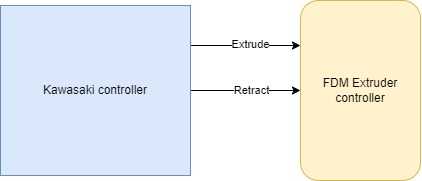

# GCODE2AS


## Description

This package can be used to translate GCODE generated by 3D printing slicers into AS code. The AS code is used by Kawasaki industrial robots.

There are currently 3 usage fields that can be selected. These are:
 - FDM 3D printing
 - Metal 3D printing
 - Laser cutting


## Installation

After cloning the repository, you can easily install the program using `pip`. To install the package, first navigate to the cloned repository folder, then use this command:

```bash
pip install .
```

## Usage

As mentioned above, the program can be used in three different modes.

To launch the program select the .gcode file to be processed and use this command:
```bash
gcode2as ./path/to/your/file.gcode
```

> You can always view the help menu by typing `gcode2as --help`
> ```
>Usage: gcode2as [OPTIONS] FILE
>Options:
>  -d      Use the default values for the options
>  -v      More verbosity in the generated code  
>  --help  Show this message and exit.
>```

After loading the file, the program will promt the user to select the appropriate working mode.
```
                                _      ____             _
             __ _  ___ ___   __| | ___|___ \ __ _ ___  | |__  _   _ 
            / _` |/ __/ _ \ / _` |/ _ \ __) / _` / __| | '_ \| | | |
           | (_| | (_| (_) | (_| |  __// __/ (_| \__ \ | |_) | |_| |
            \__, |\___\___/ \__,_|\___|_____\__,_|___/ |_.__/ \__, |
            |___/                                             |___/ 
                       _
                      | |    __ _ ___ _ __ __ _ _ __ ___
                      | |   / _` / __| '__/ _` | '_ ` _ \
                      | |__| (_| \__ \ | | (_| | | | | | |
                      |_____\__,_|___/_|  \__,_|_| |_| |_|


[?] What mode would you like to use?: FDM 3D Printing
 > FDM 3D Printing
   Laser cutting
   Metal 3D Printing
```

Here the user can select the working mode by using the arrow keys and then pressing enter to confirm the selection.

### FDM 3D printing

This mode can be used to generate .as programs that can be used with an FDM 3D printer extruder. The configuration should be as the following figure shows:



In this simple setup, only two IO signals are needed for communication.

To generate the file the user must set these configuration parameters:

```
[?] Enter the minimum distance for simplifying the toolpaths: : 2
[?] Would you like to use a different directory to save the generated file? (y/N): 
[?] Specify the extrude signal: 2001
[?] Specify the retract signal: 2002
[?] Would you like to override the speed? This creates a constant speed profile (y/N):
```

## Toolpath simplification

The .gcode files generated by slicers can contain hundreds of thousands of lines of code. In some applications this level of precision is unnecessary and makes the robot code bloated. To elliminate this problem, a simplification algorithm is implemented.

This algorithm lets the user specify a minimum (euclidean) distance; if a new feed instruction's (G1) target is closer than the specified distance, the target is ignored.

To aid the robustness of the algorithm and prevent undesirable side effects a few rules were implemented in the target selection logic:
 - only ignore targets if the z coordinate of both points is equal (only when not in vase mode)
    - this prevents ignoring points on the layer changes
 - if a target is ignored, its distance is added to an internal counter
 - if the sum of the target distance and the internal counter is larger than the minimum distance the target is not ignored and the counter is reset
    - this ensures that a multiple consecutive targets under the minimum distance do not get ignored